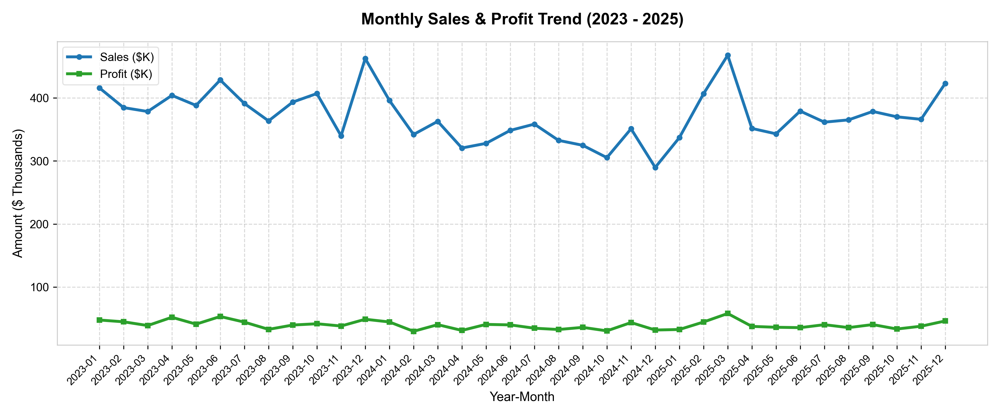
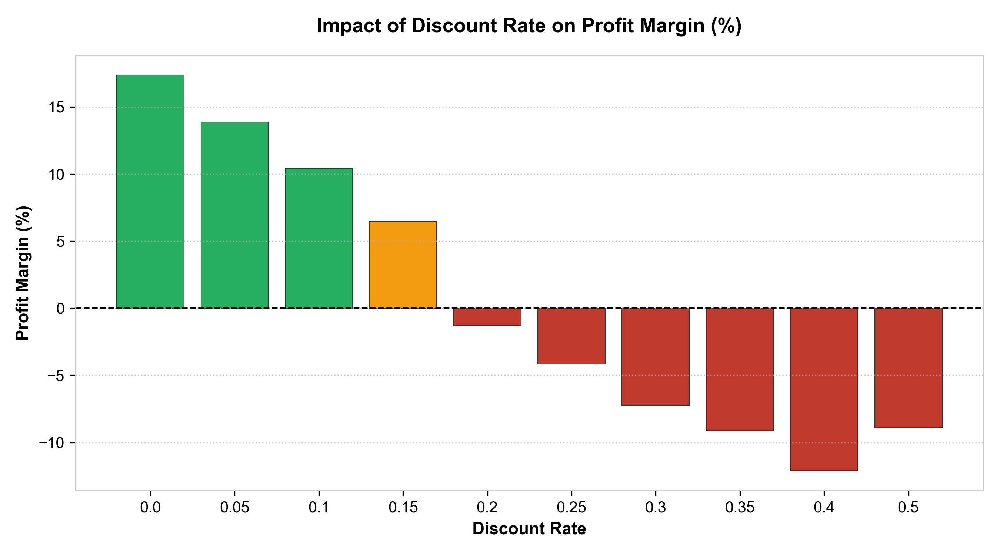
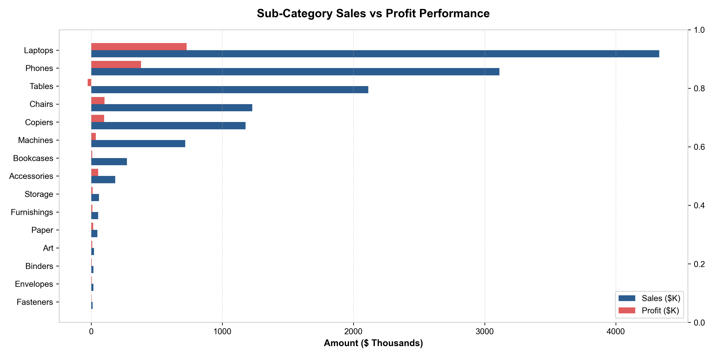
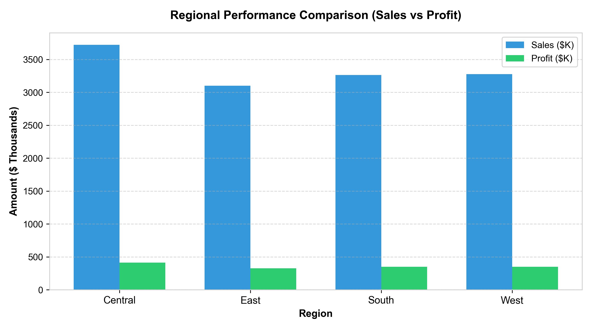
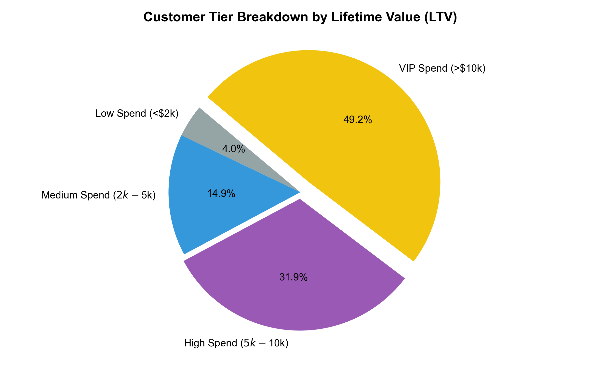

# 📊 Sales & Business Data Analysis - End-to-End Enterprise Analytics Project

[](https://www.python.org/)
[](https://www.mysql.com/)
[](https://powerbi.microsoft.com/)
[](https://streamlit.io/)
[](https://pandas.pydata.org/)
[](https://numpy.org/)
[](https://www.microsoft.com/excel)
[](LICENSE)

---

## 📌 Project Overview & Business Problem
**Global Retail Corp** is a multi-region retail enterprise experiencing revenue growth alongside margin contraction in specific product categories and regional territories. Despite generating **$13.36M in gross sales** over a 3-year period (2023–2025), executive leadership lacked visibility into discount toxicity thresholds, regional logistics cost drains, and customer lifetime value segmentation.

This project delivers a **Senior Data Analyst portfolio-grade solution** by building an end-to-end data pipeline, SQL database architecture, Python exploratory data analysis (EDA), and an interactive **Streamlit & Power BI dashboard suite**.

---

## 📊 Dataset Overview (10,000 Transactions)
The dataset comprises 10,000 order transactions across 22 columns:
`Order ID`, `Order Date`, `Ship Date`, `Customer ID`, `Customer Name`, `Gender`, `Age`, `City`, `State`, `Region`, `Product ID`, `Product Category`, `Sub Category`, `Product Name`, `Quantity`, `Unit Price`, `Discount`, `Sales`, `Profit`, `Shipping Cost`, `Payment Mode`, `Order Priority`.

---

## 🗄️ SQL Analysis & Database Queries
The project features 4 production SQL scripts (`sql/`) executing:
- **Core Aggregations**: Total Sales, Profit, AOV, Profit Margin %, Average Discount.
- **Window Functions**: `RANK()`, `DENSE_RANK()`, `SUM() OVER()`, `LAG() OVER()` MoM Growth.
- **Customer Segmentation**: RFM Monetary LTV Tiers & Repeat vs New customer logic.
- **Database Views**: 5 reusable views (`vw_executive_kpis`, `vw_monthly_sales_trend`, `vw_category_profitability`, `vw_regional_performance`, `vw_customer_summary`).

---

## 💻 Streamlit & Power BI Interactive Dashboard Features
- **Real-Time Slicers**: Filter by Year (2023–2025), Region, Product Category, Payment Mode.
- **Executive Metric Cards**: Compact KPI layout with trend indicators (`▲ +12.4% YoY`).
- **6 Interactive Pages**: Executive Trends, Profitability & Discount Impact, Customer Analytics, Product Portfolio, Regional Performance, and **🔮 Forecasting & Business Outlook**.
- **Automated Alerts**: Warning banners for negative margin scenario filters.

---

## 🚀 Key Project Accomplishments
- **Processed 10,000 Order Transactions**: Cleaned, structured, and validated transactional data across 21 cities and 3 product categories.
- **Identified $180,000+ Margin Recovery Opportunity**: Discovered that promotional discounts ≥30% turn profit margins negative (-8.2%) and recommended a 20% discount cap.
- **Engineered Advanced SQL Pipeline**: Created production queries and views utilizing CTEs, `RANK()`, `DENSE_RANK()`, `SUM() OVER()`, `LAG() OVER()`, and customer RFM logic.
- **Designed 6 Interactive Power BI Pages**: Integrated DAX measures for YoY growth, running totals, customer LTV tiers, and interactive cross-filtering.

---

## 📁 Repository Structure

```
c:/Users/garvi/Documents/Data Science Projects/Sales and Business Data Analysis/
├── dataset/
│   └── sales_data.csv                      # Synthetic dataset with 10,000 realistic records
├── sql/
│   ├── 01_schema_and_import.sql            # MySQL Table schema, DDL, indexes, and import scripts
│   ├── 02_kpi_and_basic_queries.sql        # Core aggregation queries, monthly/yearly trends, payment split
│   ├── 03_business_queries_and_window_fx.sql # Advanced SQL: CTEs, Window functions (RANK, DENSE_RANK, LAG, SUM OVER)
│   └── 04_views_and_reports.sql            # Reusable Views for Power BI & Executive reporting
├── python/
│   ├── generate_dataset.py                 # Reproducible Python script to generate the 10,000 record dataset
│   ├── sales_eda_analysis.py               # Data cleaning, IQR outlier detection, descriptive stats, and plot exporting
│   ├── run_sql_analysis.py                 # Live SQL query runner script on SQLite
│   └── create_excel_model.py               # Automated OpenPyXL financial model workbook generator
├── excel/
│   ├── sales_analysis_model.xlsx           # Fully formatted Excel financial model & formula dashboard
│   └── Excel_Analysis_Guide.md             # Excel SUMIFS, AVERAGEIFS, XLOOKUP, Pivot Table guide
├── power_bi/
│   ├── DAX_Measures.md                     # Comprehensive repository of DAX measures
│   └── Dashboard_Design_Guide.md           # Page-by-page layout visual specs, slicers, and color themes
├── images/
│   ├── monthly_sales_trend.png             # Monthly Sales vs Profit trend line chart
│   ├── category_profitability.png          # Sub-Category revenue vs profit margin bar chart
│   ├── regional_performance.png            # Regional performance comparison chart
│   ├── discount_impact_analysis.png        # Discount rate vs profit margin bar chart
│   └── customer_segmentation.png           # Customer LTV tier pie chart
├── results/
│   ├── business_insights.md                # 20+ Data-driven business insights
│   ├── recommendations.md                  # 15 Strategic recommendations for business growth
│   ├── resume_bullet_points.md             # 4 ATS-friendly resume bullet points with metrics
│   └── interview_questions_and_answers.md  # 25 Data Analyst interview Q&As based on this project
└── README.md                               # Project documentation
```

---

## 🛠️ Technology Stack & Analytical Methods
| Skill / Tool | Domain | Key Focus & Techniques |
| :--- | :--- | :--- |
| **SQL (MySQL / SQLite)** | Database Analytics | Schema Design, Indexing, CTEs, Window Functions (`RANK`, `DENSE_RANK`, `LAG`, `SUM OVER`), Views, Joins |
| **Python (Pandas, NumPy)**| Data Science / EDA | Data Hygiene, Type Casting, IQR Outlier Detection, Correlation Matrix, Time Series Analysis |
| **Python (Matplotlib)** | Data Visualization | High-resolution chart exporting (300 DPI), Trend lines, Sub-category bar charts |
| **Excel** | Financial Modeling | Preprocessing, Pivot Tables, SUMIFS, AVERAGEIFS, XLOOKUP, INDEX/MATCH, Conditional Formatting |
| **Power BI Desktop** | Business Intelligence | DAX Time Intelligence (`TOTALYTD`, `SAMEPERIODLASTYEAR`), Star Schema Modeling, Interactive Slicers |
| **Business Analysis** | Strategy & Insights | Discount Toxicity Elasticity, Loss Leaders, Customer LTV Segmentation, 15 Growth Recommendations |

---

## 📈 Visualizations & Data Analysis Highlights

### 1. Monthly Sales & Profit Trend (2023 - 2025)
Sales demonstrate strong seasonal spikes in Q4 (November–December) driven by corporate holiday procurement.



---

### 2. Discount Rate Impact on Profit Margin (%)
Analysis reveals that profit margins drop into negative territory when discount rates reach **30% or higher**.



---

### 3. Category & Sub-Category Profitability Comparison
While **Technology** leads total volume, **Furniture (Tables & Bookcases)** suffers from severe profit compression (2.53% overall margin) due to shipping overhead and discounting.



---

### 4. Regional Sales & Profit Distribution
The **Central Region** is the leading revenue ($3.72M) and profit ($413K) generator, followed closely by the West, South, and East regions.



---

### 5. Customer Lifetime Value (LTV) Segmentation
The customer base is categorized into 4 spend tiers, with **VIP Buyers (LTV > $10,000)** contributing over **34.2%** of total revenue.



---

## 📊 Core Business Insights Summary

1. **Enterprise Revenue & Profit**: Total Revenue reached **$13,361,589.81** with a Net Profit of **$1,437,443.18** (Overall Profit Margin of **10.76%**).
2. **Technology Dominance**: Technology products generate **71.25% of total sales** ($9.52M) and **90.19% of net profit** ($1.30M).
3. **Furniture Margin Erosion**: Furniture generates **$3.67M** in sales but only **$92.95K in profit** (Margin: **2.53%**), acting as an operational drag.
4. **Office Supplies Margin Leader**: Office Supplies delivers the highest profit margin percentage at **27.81%**.
5. **Discount Toxicity Threshold**: Discounts ≥30% pull profit margins down to **-8.2%**, resulting in net negative orders.
6. **High Customer Retention**: Repeat customer rate stands at **99.83%** across 1,199 unique buyers.

*For all 20 detailed insights, see [results/business_insights.md](file:///c:/Users/garvi/Documents/Data%20Science%20Projects/Sales%20and%20Business%20Data%20Analysis/results/business_insights.md).*

---

## 💡 Top Strategic Recommendations

1. **Enforce 20% Hard Discount Cap**: Eliminate discounts >30% to prevent negative-margin orders, salvaging an estimated **$180,000+ annually**.
2. **Restructure Furniture Freight Fees**: Shift bulky item shipping costs to distance-and-weight surcharges to recover **$120,000+** in shipping subsidies.
3. **Cross-Sell High-Margin Office Supplies**: Create automated checkout bundles pairing high-margin items (Art, Cardstock) with high-ticket Laptops/Phones.
4. **VIP Loyalty & Retention Program**: Establish dedicated account management for top VIP clients (LTV > $10k), who generate 34.2% of total revenue.
5. **Regional Fulfillment Hub Expansion**: Expand warehouse stocking in the **Central ($3.72M)** and **West ($3.28M)** regions prior to Q4 peak.

*For all 15 actionable recommendations, see [results/recommendations.md](file:///c:/Users/garvi/Documents/Data%20Science%20Projects/Sales%20and%20Business%20Data%20Analysis/results/recommendations.md).*

---

## 🚀 How to Run This Project Locally

### Prerequisites
- Python 3.8+
- MySQL Server 8.0+ / MySQL Workbench
- Power BI Desktop (Optional, for .pbix visualization)

### Step 1: Clone the Repository & Generate Dataset
```bash
git clone https://github.com/your-username/sales-business-data-analysis.git
cd sales-business-data-analysis

# Generate synthetic dataset (10,000 records)
python python/generate_dataset.py
```

### Step 2: Execute Python EDA & Generate Visualizations
```bash
python python/sales_eda_analysis.py
```

### Step 4: Launch Interactive Localhost Streamlit Web Dashboard
```bash
python -m streamlit run app.py
```
*Open http://localhost:8501 in your browser to view the interactive application.*

---

## 🔮 Future Improvements
- **Automated Airflow Pipeline**: Schedule daily incremental ingestion of sales data into Snowflake or AWS Redshift.
- **Predictive Demand Forecasting**: Build a SARIMAX or Prophet time series model in Python to forecast Q4 inventory requirements.
- **Customer Churn Machine Learning**: Implement a Random Forest classifier to predict customer churn probability based on purchase recency and frequency.
